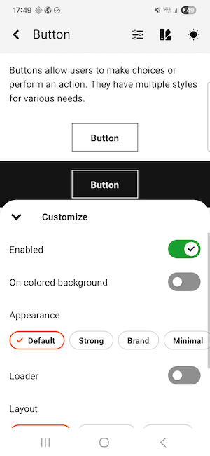
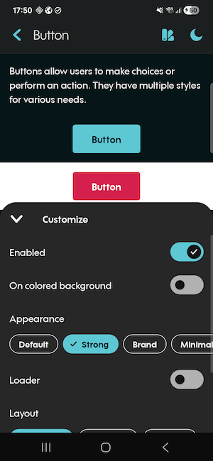

# OUDS Android

[](https://apilevels.com)
[](https://scorecard.dev/viewer/?uri=github.com/Orange-OpenSource/ouds-android)
[](https://www.bestpractices.dev/projects/12397)

[](LICENSE)
[](https://android.unified-design-system.orange.com/)

This repository contains the OUDS Android library that provides Orange Android components, but also a demo application showcasing these different components.

OUDS stands for "Orange Unified Design System". Its aim is to merge all the requirements of Orange brands and affiliates to provide a unique Design System,
unified across all platforms and all countries.

OUDS Android documentation is available at [android.unified-design-system.orange.com](https://android.unified-design-system.orange.com/).

To see OUDS Android in action, you can download the [Design Toolbox demo app](http://oran.ge/designtoolbox). The `app` module contains the code for this
application.

## :rocket: Quick Start

### Add OUDS Android to your project

OUDS Android is available through [Maven Central Repository](https://central.sonatype.com/search?q=com.orange.ouds.android). To use it, add the OUDS Android
library core and the theme you want to use in the `dependencies` section of your app build script:

<details open>
<summary>Kotlin DSL</summary>

```kotlin
dependencies {
    // ...
    implementation("com.orange.ouds.android:ouds-core:1.3.0")
    implementation("com.orange.ouds.android:ouds-theme-orange:1.3.0")
    // ...
}
```

</details>

<details>
<summary>Groovy DSL</summary>

```shell
dependencies {
    // ...
    implementation 'com.orange.ouds.android:ouds-core:1.3.0'
    implementation 'com.orange.ouds.android:ouds-theme-orange:1.3.0'
    // ...
}
```

</details>

### Select and apply your theme

To access OUDS components and tokens throughout your app, you must wrap your UI hierarchy with `OudsTheme` instead of `MaterialTheme`.  
This composable requires a `theme` parameter to define the visual identity to apply (e.g., `OrangeTheme`, `SoshTheme`, `WireframeTheme`).

```kotlin
OudsTheme(
    theme = OrangeTheme(
        orangeFontFamily = OrangeFontFamily(
            latin = OrangeHelveticaNeueLatin.Bundled(
                regularFontResId = R.font.helvetica_neue_latin_roman,
                mediumFontResId = R.font.helvetica_neue_latin_medium,
                boldFontResId = R.font.helvetica_neue_latin_bold
            )
        )
    )
) {
    // Use OUDS Android or Material components here for an interface
    // matching the Orange Unified Design System with the Orange theme
}
```

> [!WARNING]
> Make sure to add the corresponding theme as a Gradle dependency.

## :iphone: Design Toolbox App

The `app` directory of this repository contains Design Toolbox app which is a showcase of what OUDS Android library offers.
It allows you to benefit from sample codes to help you learn about OUDS Android use.

Scan the following QR code with your device to download the latest version of the Design Toolbox app:


Or, follow this link: [http://oran.ge/designtoolbox](http://oran.ge/designtoolbox)

The Design Toolbox app allows you to test OUDS components in several themes in Light or Dark mode.

<table align="center">
    <tr>
        <td></td>
        <td></td>
    </tr>
</table>

## :beetle: Bugs and Feature Requests

Have a bug or a feature request? Please first search for existing and closed issues. If your problem or idea is not addressed
yet, [please open a new issue](https://github.com/Orange-OpenSource/ouds-android/issues/new/choose).

## :handshake: Contributing

Please read through our [contributing guidelines](https://github.com/Orange-OpenSource/ouds-android/blob/main/CONTRIBUTING.md).
Included are directions for opening issues, coding standards, and notes on development.

## :lock: Data Privacy

The Orange Unified Design System library is an SDK that allows a developer to create Orange branded mobile application. As such:

- this SDK does not handle any personal data.
- this SDK does not require any device permission to work.

## :balance_scale: Copyright and License

Code released under the [MIT License](https://github.com/Orange-OpenSource/ouds-android/blob/main/LICENSE).
