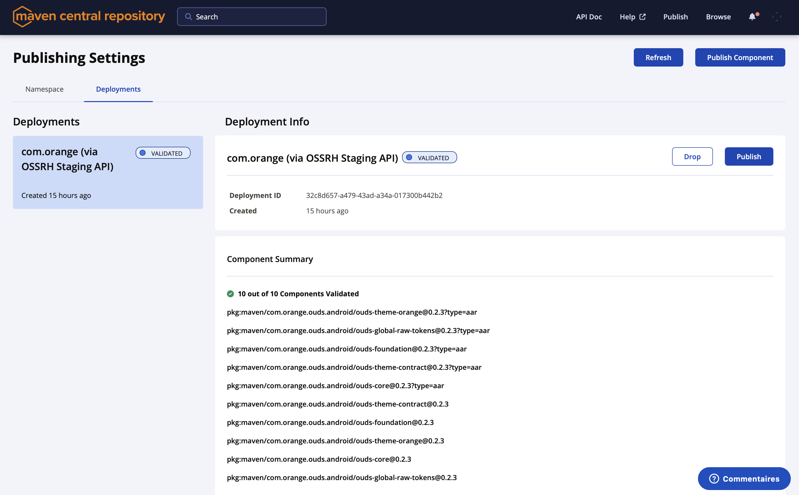

# OUDS Android release guide

This file lists all the steps to follow when releasing a new version of OUDS Android.

- [Prepare release](#prepare-release)
- [Release](#release)
    * [Publish release to Maven Central](#publish-release-to-maven-central)
    * [Publish release to GitHub](#publish-release-to-github)
    * [Publish release to Google Play Store](#publish-release-to-google-play-store)<br /><br />

## Prepare release

- Create a branch named `prepare-release` to prepare the new release for OUDS Android version X.Y.Z.

- Switch to this branch and launch the `prepareRelease` Gradle task:

    ```shell
    ./gradlew prepareRelease
    ```

  This task finds the next semantic version based on conventional commits and performs the following changes to the project:

    - Update `version` project property in `gradle.properties`.
    - Update version of OUDS Android dependencies in various Markdown files.
    - Increment the app `versionCode` in associated `build.gradle.kts` file.
    - Update content of `CHANGELOG.md`.
    - Archive the documentation in `docs/previousDocVersions/X.Y.Z`.

  You can optionally launch `prepareRelease` with a version property to force the release version:

    ```shell
    ./gradlew prepareRelease -Pversion=X.Y.Z
    ```

- Verify the changes mentioned above, then commit and push.

- Create a new pull request named `chore: prepare release X.Y.Z` on GitHub to merge your branch into `develop`.

- Review and merge this pull request on GitHub.<br /><br />

## Release

- Create a new pull request named `chore: release X.Y.Z` on GitHub to merge `develop` into `main`.

- Review and merge this pull request on GitHub.

- Switch to the latest main commit and launch the `tagRelease` Gradle task:

    ```shell
    ./gradlew tagRelease
    ```

  This task adds an `X.Y.Z` tag and push it to the remote repository.<br /><br />

### Publish release to Maven Central

- Go to [GitHub Actions](https://github.com/Orange-OpenSource/ouds-android/actions) and open the workflow launched by the tag creation.

- Click `Review deployments`, select `maven-central-release` and click `Approve and deploy`.

  

- Go to [Sonatype Nexus Repository Manager](https://oss.sonatype.org).

- Click `Staging Repositories` and verify the content of the OUDS Android repository.

  

- Click `Close` if content is OK or `Drop` otherwise.

- Retrieve the Sonatype repository ID from either the repository name or URL.

  

- Launch the `testSonatypeRepository` Gradle task using the ID from the previous step:

    ```shell
    ./gradlew testSonatypeRepository -PsonatypeRepositoryId=<repository_id>
    ```

  This task allows you to test the release before it is deployed to Maven Central and performs the following changes to the project:

    - Add Sonatype Maven repository.
    - Remove all Android Studio modules except `app`.
    - Replace project dependencies with module dependencies in `app`.

- Synchronize Gradle, build app, deploy and test on device.

- Go back to Sonatype Nexus Repository Manager and click `Release`.<br /><br />

### Publish release to GitHub

- Go to [GitHub Actions](https://github.com/Orange-OpenSource/ouds-android/actions), open the release workflow, click `Review deployments`, select
  `github-release` and click `Approve and deploy`.

- Go to [GitHub Releases](https://github.com/Orange-OpenSource/ouds-android/releases).

- Edit the new release draft.

  

- Set previous tag and click `Generate release notes` to automatically generate the release notes.

  

- Verify the release notes using the preview tab.

- Optionally check `Set as a pre-release` and click `Publish release`.<br /><br />

### Publish release to Google Play Store

- Go to [GitHub Actions](https://github.com/Orange-OpenSource/ods-android/actions), open the release workflow, click `Review deployments`, select
  `google-play-store-release` and click `Approve and deploy`.

- Go to [OMA Portal](https://oma-portal.orange.fr) and open the `Design System Toolbox [OUDS Demo]` dashboard.

- Click `Integrations`, find the uploaded bundle in the `Artifacts` sections and click `Create release`.

  

- Set `Release type` to `Beta (Open or Closed)` and click `Submit`.

  

- Progress through the various submission steps.

- When step is `Store submissions`, select `Closed beta with Google Groups`, set `Email addresses` to `design-toolbox-android@googlegroups.com` and click
  `Go for store submission`.

  <br /><br />

- Click on `Go to publish` when step is `Store publication`. This is the last manual action required to publish the release.

  
